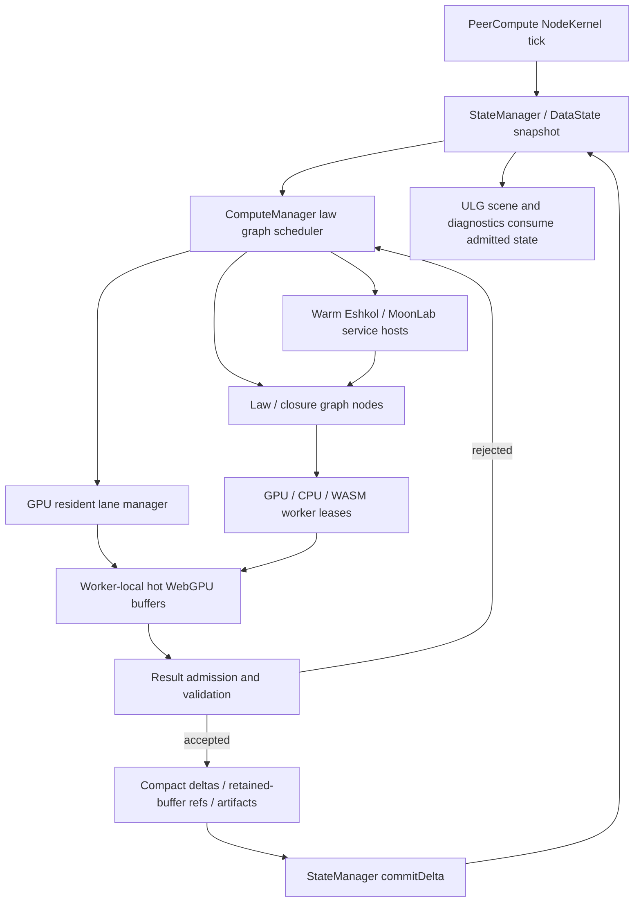
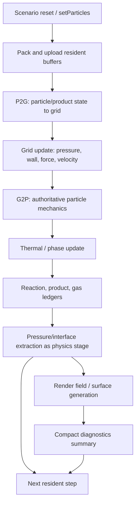
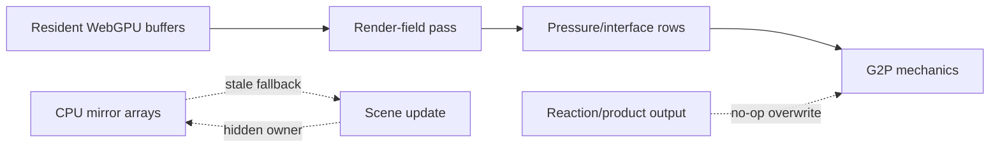
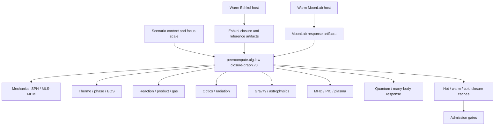
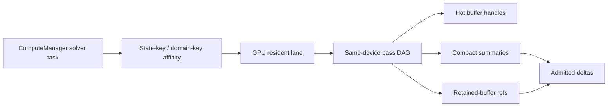

# Physics Loop And Authority Diagrams

Date: 2026-06-12 AKDT

These diagrams capture the intended direction after the WebGPU-resident refactor
bugs. They are planning diagrams, not proof that the runtime already behaves
this way.

## Target Distributed Main Loop

Key point: the scene observes and presents state. It should not become the
distributed authority for law scheduling or accepted mutation. The GPU lane is
an execution backend under ComputeManager, not a second scheduler.

## Resident Physics Stage Order

Authority rule: G2P owns mechanics after it runs. Thermal, reaction, pressure,
and render stages can only write their declared families unless a new stage
explicitly declares and validates a mechanics write.

## Current Bug Shape To Avoid

The target fix is to remove hidden authority edges:

- stale CPU mirrors cannot override resident state;
- render-field execution cannot be required for pressure physics;
- no-op reaction/thermo outputs cannot overwrite mechanics;
- retained buffers cannot be destroyed before declared consumers run.

## Law And Closure Graph

Multiscale rule: all scales can influence each other through closures, boundary
conditions, and correction terms, but only the active focus region should run at
the highest resolution.

## Copy Avoidance Shape

Copy rule: do not fan one mutable resident state through arbitrary GPU child
workers until domain ownership and boundary exchange are explicit.
